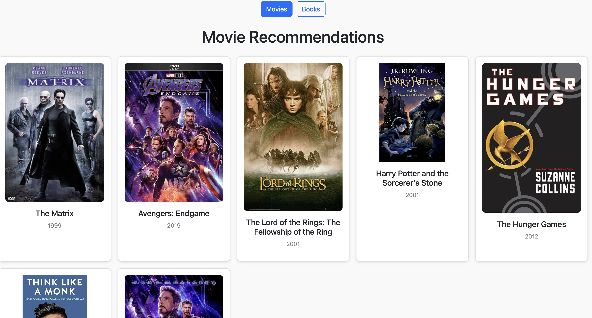

# Movie and Book Recommender Project

A React app that displays movie and book recommendations in a card layout. Users can toggle between movies and books. The project demonstrates core React concepts and best practices.

## Features & Concepts

useState: Manage toggle state between movies and books

map function: Render lists of movies and books dynamically

Modularity: Separate components (App, MovieCard)

Fragments: Used to avoid extra HTML elements

CSS Modules: Scoped styling with hover effects

Bootstrap: Styling for buttons and responsive layout

Movie View:

Book View:

