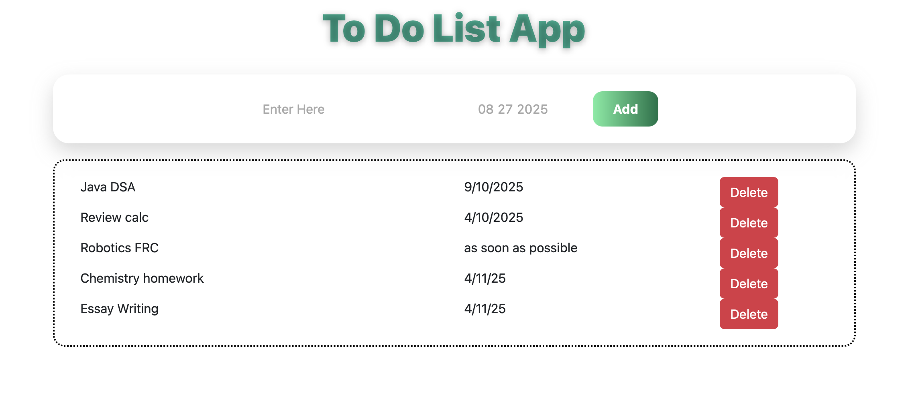

# To-Do List Project

This project demonstrates the use of React to build a modular and dynamic user interface. It allows users to add new tasks efficiently by directly updating the underlying array, showcasing a more optimized approach compared to traditional brute-force methods.

## Key features:

Modular component-based structure for scalability

Dynamic task addition and management

Clean and responsive UI

