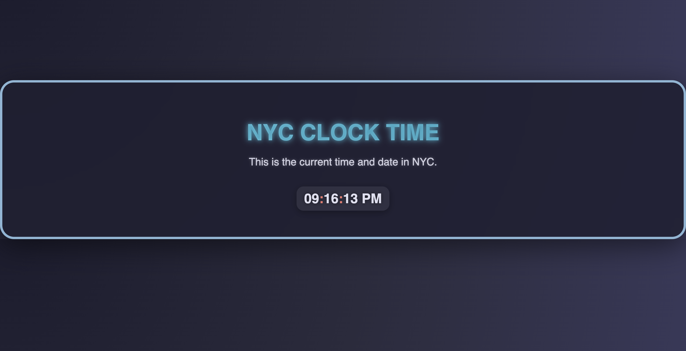

# NYC CLOCK

A modern digital clock displaying the current time and date in New York City with a visually appealing animated design using React and CSS.

## Features

- Live time and date updated every second.

- 12-hour format with AM/PM.

- Animated heading and container with floating effect.

- Neon-style blinking colons for the clock.

- Responsive design for mobile and desktop.

- Built using React, useState, useEffect, and CSS animations.
  
