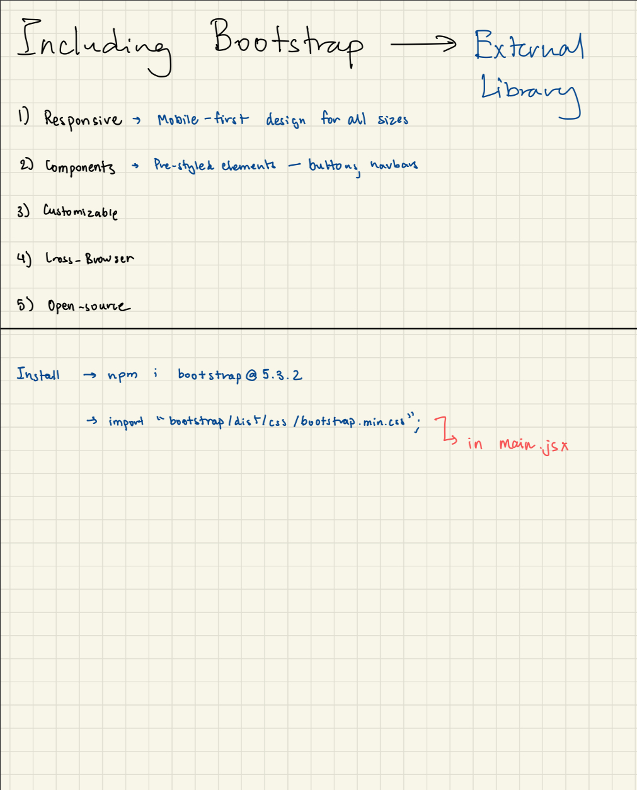

# What is React?

- React is a javascript library that is used to build dynamic and interactive user interfaces.
- It was developed at facebook in 2011.
- Currently the most wisely used JavaScript library for front-end development.
- Used to create **single-page application**.

# DOM

- Stands for **_ document object model_**
- Browser takes HTML and create DOM
- JS helps us modify DOM based on user's action and other events.
- In huge applications, DOM becomes complicated

# Why react?

- Simpler mental model
- JS is Error-prone, hard to maintain and cumbersome.
- In react, no need to worry about queryin gand updating DOM
- it creates web page with small components that are reusable.
- react takes care of creating and updating DOM.

# Javascript vs React

- JavaScript is imperative.
- defines step to get output.
- React is declarative.
- figures the UI state and react figues out how to react that UI state.

# npm

npm stands for node package module

```bash
npm create vite@latest
```

## Project Structure

```bash

my-app/
├─ node_modules/ # Contains all npm packages
├─ public/ # Static files (images, favicon, etc.)
├─ src/ # Your main source code
│ ├─ assets/ # Images, fonts, etc.
│ ├─ components/ # Reusable React components
│ ├─ App.jsx # Main App component
│ └─ main.jsx # Entry point of React app
├─ index.html # HTML template
├─ package.json # Project metadata & dependencies
├─ vite.config.js # Vite configuration
└─ .gitignore # Files ignored by Git
```

React Application is a tree of componets with app component as the root (main) component bringing everything together.

Here’s a continuation of your React notes with the **Project Structure** and some more fundamentals:

---

# Basic React Concepts

### 1. Components

- Components are the **building blocks** of React.
- Can be **functional** (function) or **class-based** (class).
- Example of a functional component:

```jsx
function Hello() {
  return <h1>Hello, React!</h1>;
}
```

- Components are reusable.

---

### 2. JSX

- JSX stands for **JavaScript XML**.
- Allows writing HTML-like syntax in JS.
- Example:

```jsx
const element = <h1>Hello, world!</h1>;
```

- Under the hood, React converts JSX to `React.createElement()` calls.

---

### 3. Props

- Props = **Properties**
- Used to **pass data** from parent to child component.

```jsx
function Greeting(props) {
  return <h1>Hello, {props.name}</h1>;
}

// Usage
<Greeting name="Jamisha" />;
```

---

### 4. State

- State = **data that changes over time**
- Managed inside the component.
- Functional components use `useState` hook:

```jsx
import { useState } from "react";

function Counter() {
  const [count, setCount] = useState(0);

  return (
    <div>
      <p>Count: {count}</p>
      <button onClick={() => setCount(count + 1)}>Increment</button>
    </div>
  );
}
```

- Updating state triggers **re-render** automatically.

---

### 5. Events

- React handles events like JS but with **camelCase** syntax.
- Example:

```jsx
<button onClick={handleClick}>Click me</button>
```

---

## Bootstrap


