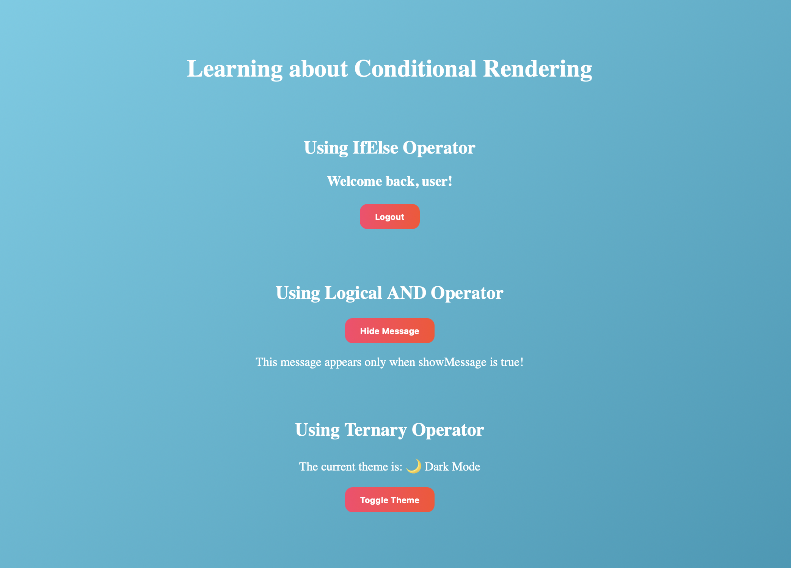

# Conditional Rendering

This project demonstrates **conditional rendering in React** using three different approaches:

1. **If-Else Statements**

   - Handles conditions in a more traditional way before returning JSX.

2. **Logical AND (`&&`) Operator**

   - Renders components only when a certain condition is true.
   - the first argument has to be true for the second argument to be executed.

3. **Ternary Operator (`? :`)**
   - This provides inline conditional rendering with two possible outcomes.

---

## Components

- `IfElse.js` → Example using if-else.
- `LogicalAnd.js` → Example using logical AND (`&&`).
- `Ternary.js` → Example using ternary operator.

---

Screenshot

